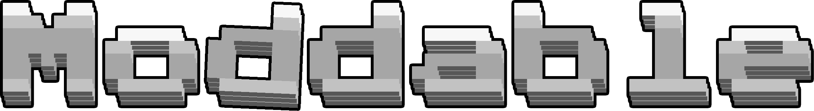

### Moddable is a modding platform for modern versions of CelLua. It adds modulation that is compatible with multiple versions of the game, making it possible to easily port it from one version to the next.

# Wiki
I basically only made this page to redistribute the mod platform and give you some [wiki](/../../wiki) information. Feel free to browse it!
